# La Bible dit-elle vrai ? (5/5)

## Le livre de l'apocalypse

> Ap 1,1  Révélation de Jésus-Christ *ἀποκάλυψις Ἰησοῦ Χριστοῦ*

* apo-calypse
  
  * révélation
  
  * dévoilement

* de Jésus Christ :
  
  * Jésus-Christ dévoile "la révélation" que Dieu lui a donnée

> Ap 1,1-2 Révélation de Jésus-Christ, que Dieu lui a donnée pour montrer à ses esclaves ce qui doit arriver bientôt ; il l’a signifiée en envoyant son ange à son esclave Jean, qui a témoigné de tout ce qu’il a vu : la parole de Dieu et le témoignage de Jésus-Christ.

En ouverture, le livre décrit la "chaîne de transmission" de cette révélation

* qui part de Dieu (et qui consiste en sa parole)

* via le *témoignage* de Jésus Christ

* par la médiation de l'ange

* qui permet à Jean de *témoigner*
  
  * à l'intention des lecteurs du livre

> Ap 1, 3 **Heureux** celui qui **lit à haute voix** les paroles de la prophétie, comme ceux qui les **entendent** et qui **gardent** ce qui y est écrit ! Car le temps est proche.

* il faut remarquer que le livre s'ouvre sur une BÉATITUDE : "heureux".

* la lecture à voix haute évoque un contexte liturgique
  
  * le lecteur du livre de l'Apocalypse est invité à entrer dans la disposition de ceux qui entendent et qui gardent ce qui est écrit.

* de nombreux *cantiques* ponctuent le livre, certains sont repris dans la liturgie des heures :
  
  * le livre "dévoile" une immense liturgie céleste
  
  * et se conclut sur un échange de paroles "liturgiques" 
  
  > Ap 22, 20 Celui qui atteste [témoigne] ces choses dit : *Oui, je viens bientôt*. 
  > 
  > **Amen ! Viens, Seigneur Jésus !**
  
  * cette dernière parole est suggérée au lecteur comme réponse
  
  * le lecteur est comme invité à participer à cette liturgie que le livre dévoile
  
  > Ap 22,17 Que celui qui entend dise : **Viens** !
  > 
  > Ap 19,9  Il me dit : Écris : *Heureux ceux qui sont invités au dîner des noces de l’agneau* ! Puis il me dit : *Ce sont là les vraies paroles de Dieu*.
  
  * l'influence sur la liturgie est manifeste (Agneau de Dieu)
  
  * le livre de l'apocalypse dit VRAI... 
  
  > Ap 22,6 Il me dit : Ces paroles sont certaines et vraies ; le Seigneur, le Dieu des esprits des prophètes, a envoyé son ange pour montrer à ses esclaves ce qui doit arriver bientôt.
  
  * il ne reste plus qu'à essayer de comprendre ce que ce livre veut dire !

> Ap 1, 3  
> Heureux celui qui lit à haute voix les paroles de la prophétie, comme ceux qui les entendent et qui gardent ce qui y est écrit ! **Car le temps est proche**.

* le temps qui est "proche" est celui de la venue du Seigneur Jésus, comme l'atteste la fin du livre
  
  > Oui, je viens bientôt.
  
  * l'enjeu n'est sans doute pas la **durée** du temps qui reste
  
  * ce qui importe, c'est plutôt la **qualité** du temps qui reste :  
  
  * le fait que le Seigneur vient "bientôt" modifie la manière de vivre le temps présent.

* le livre révèle ce qui est déjà *accompli*... 
  
  * même si cet accomplissement n'est pas encore tout à fait manifesté
  
  * il est déjà dévoilé dans le livre, notamment dans la liturgie céleste
  
  > Ap 11, 15 Le septième ange sonna de la trompette. Il y eut dans le ciel des voix fortes qui disaient : « *Il est advenu sur le monde, le règne de notre Seigneur et de son Christ. C’est un règne pour les siècles des siècles*. »

On peut lire Ap comme une grande méditation de l'événement de Pâques :

* Jésus crucifié 
  
  * Agneau immolé

* Jésus ressuscité 
  
  * Agneau victorieux

* Jésus participant de la royauté souveraine de Dieu
  
  * Agneau glorieux

L'espace et le temps du livre "débordent" l'espace et le temps ordinaires : c'est pourquoi l'agneau est à la foix immolé et glorieux.

## L'apocalypse, source inspiration pour les artistes

### Tapisserie du château d'Angers

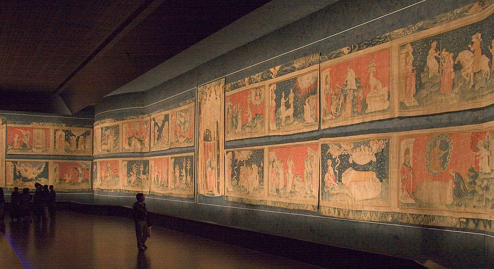

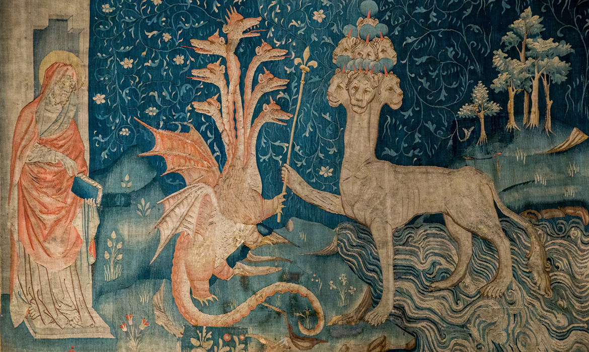

> Ap 13,1-2  Alors je vis monter de la mer une bête qui avait dix cornes et sept têtes ; sur ses cornes, dix diadèmes, sur ses têtes des noms blasphématoires.
> La bête que je vis était semblable à un léopard, ses pattes étaient comme celles d’un ours et sa bouche comme la bouche d’un lion. Le dragon lui donna sa puissance, son trône et un grand pouvoir.

[apocalypse-saint-emilion.com](http://apocalypse-saint-emilion.com/plan%20general.html)

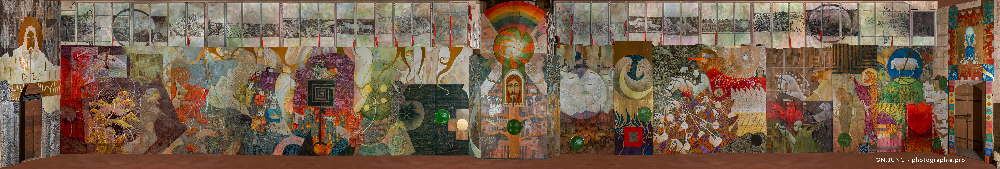

* au Centre : le Christ
  
  * Agneau dans communion trinitaire
  
  * Parole plus acérée qu'un glaive à deux tranchants

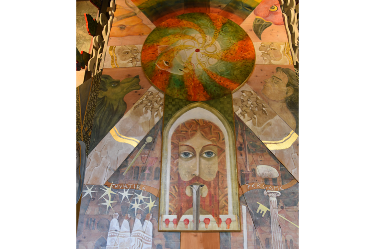

* Côté gauche : les ennemis de l'Agneau
  
  * Dragon et bêtes

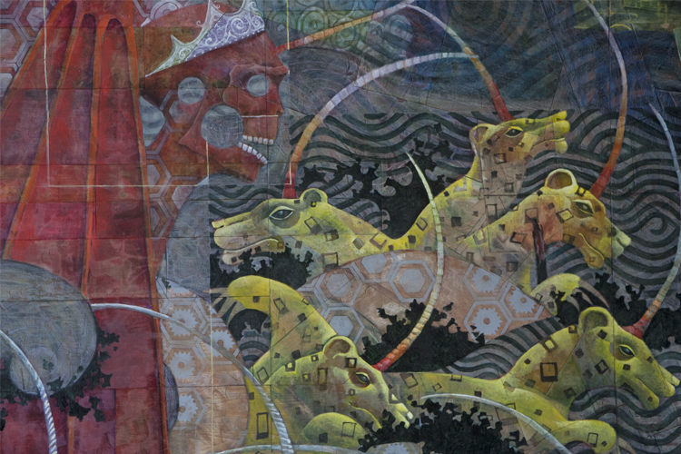

* Côté droit : l'Agneau et ses fidèles

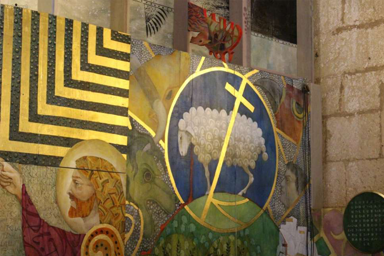

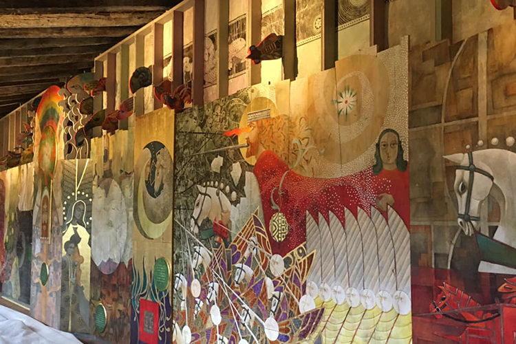

> Ap 19, 11-16 Alors je vis le ciel ouvert, et un cheval blanc apparut. Celui qui le monte s’appelle Fidèle et Vrai, il juge et fait la guerre avec justice.
> Ses yeux sont comme un feu flamboyant ; sur sa tête il y a beaucoup de diadèmes ; il porte un nom écrit que personne ne connaît, sinon lui,
> et il est habillé d’un vêtement trempé de sang. Son nom est La Parole de Dieu.
> Les armées qui sont dans le ciel le suivaient sur des chevaux blancs, revêtues de fin lin, blanc et pur.
> De sa bouche sort une épée acérée avec laquelle il doit frapper les nations ; c’est lui qui les fera paître avec un sceptre de fer

* La fresque met en espace le thème du combat
  
  * en mettant au centre le Christ-Agneau

> Ap 11,15  « *Il est advenu sur le monde, le règne de notre Seigneur et de son Christ. C’est un règne pour les siècles des siècles*. »
> 
> Ap 12,10 "*Maintenant sont arrivés le salut, la puissance, le règne de notre Dieu et le pouvoir de son Christ. Car il a été jeté à bas, l’accusateur de nos frères, celui qui les accusait devant notre Dieu jour et nuit*".

### Structure du livre

* Le livre, lui, est structuré en plusieurs étapes, dont certaines s'organisent en septénaires (= ensemble de 7)
  
  * même s'il n'est pas évident de structurer le livre,
  
  * on peut repérer le début / la fin... et les visions intermédiaires
1. Prologue ("révélation de Jésus Christ... ce qui doit arriver bientôt")

2. Lettres aux 7 églises (chap. 1- 3)

3. Visions
   
   * Cour céleste :  l'Unique sur le trône et l'Agneau (chap. 4-5)
   
   * Sept sceaux (chap. 6-7)
   
   * Sept trompettes (chap. 8-11)

4. Visions
   
   * Dragon, bêtes, Agneau (chap. 12- 14)
   
   * Sept fléaux et sept coupes (chap. 15-16)
   
   * Jugement de Babylone, la Grande prostituée (chap. 17-19)
   
   * Victoire du Christ et fin de l'histoire => Jérusalem céleste (Ap 20 - 22,5)
     
     sur la bête et le prophète de mensonge, puis sur "le dragon, le serpent d’autrefois, qui est le diable et le Satan", et enfin sur la mort elle-même
     
     > La mort et le séjour des morts furent jetés dans l’étang de feu.

5. Épilogue ("oui je viens bientôt")  (chap. 22, 6-21)

#### mise en garde

> Ap 1,1-2 Révélation de Jésus-Christ, que Dieu lui a donnée pour **montrer** à ses esclaves **ce qui doit arriver bientôt**

On peut interpréter diversement "ce qui doit arriver bientôt"

- la finale du livre "Voici je viens bientôt" fait écho à l'ouverture du livre !
  
  - c'est le Seigneur Jésus qui vient "bientôt"
  
  - lorsque la Jérusalem céleste descend... 

- Quel rapport entre "ce qui doit arriver bientôt" et les diverses visions "catastrophiques" qui font la richesse et la difficulté du livre ?
  
  - le livre est il écrit pour que le lecteur cherche à décrypter les indices de l'approche de la "fin" ?
  
  - les indices seraient alors donnés de manière mystérieuse (pour ne pas dire voilée... ce qui serait paradoxal pour un livre dont l'objet est le dévoilement)

> Mc 13,3-5 Comme il était assis sur le mont des Oliviers, en face du temple, Pierre, Jacques, Jean et André se mirent à l’interroger, en privé :
> "Dis-nous, quand cela arrivera-t-il ? Quel sera le signe annonçant la fin de toutes ces choses ?" 
> Jésus se mit alors à leur dire : "**Prenez garde que personne ne vous égare**".
> 
> ...
> 
> Pour ce qui est du jour ou de l’heure, **personne ne les connaît**, pas même les anges dans le ciel, pas même le Fils, mais le Père seul.

A la lumière de cet avertissement de Jésus, dans l'évangile selon Marc, mieux vaut éviter de lire les grandes visions des chapitres 4-19 comme des prévisions "météo" de la fin des temps...

* ces chapitres ne sont pas écrits pour que le lecteur scrute le jour ou l'heure
  
  * "bientôt"
  
  * personne ne connaît le jour ni l'heure

* on évitera de dire que nous en sommes au sixième sceau, à la cinquième trompette, ou à la quatrième coupe... 
  
  * car les visions ne sont pas des descriptions "en détails" d'événements réalistes... 
  
  * il est bon de se rappeler le conseil de Jésus "Prenez garde que personne ne vous égare" 
  
  * comme l'écrit Raymond E. BROWN (*Que sait-on du Nouveau Testament ?*,  p.845)
  
  > Ce sont des symboles eschatologiques, et toute identification précise avec des catastrophes se produisant de nos jours est vaine.

## Les lettres aux églises

#### introduction

> Ap 1, 9-11  **Moi, Jean**, votre frère, qui prends part à la **détresse**, à la **royauté** et à la **persévérance** en Jésus, j’étais dans l’île appelée **Patmos** à cause de la parole de Dieu et du témoignage de Jésus quand je fus **saisi par l'Esprit**, au **jour du Seigneur** ; j’entendis derrière moi une voix, forte comme le son d’une trompette, qui disait : 
> 
> "**Ce que tu vois**, écris-le dans un **livre**, et envoie-le aux **sept Eglises** : à Ephèse, à Smyrne, à Pergame, à Thyatire, à Sardes, à Philadelphie et à Laodicée".

* Jean de Patmos, l'auteur du livre, porte le même nom que Jean le fils de Zébédée, et que l'auteur de 3 lettres du Nouveau Testament (parfois appelé Jean l'ancien)
  
  * l'identité précise de ces trois auteurs (sont-ils une même personne?) est discutée...
  
  * le style littéraire de Ap diffère nettement de celui de Jn
  
  * mais des liens forts unissent les deux livres, notamment la figure de l'Agneau, centrale dans Ap.
  
  * Ap appartient certainement à l'école johannique.

* Jean est à Patmos, une île isolée
  
  * "détresse" => Jean est-il exilé ? Cet exil est-il une forme de persécution ?
  
  * en tous cas, Jean est "à distance"... il peut prendre du recul, et voir les choses à bonne distance => visions

* il doit écrire dans un livre
  
  * même s'il y a 7 lettres (une pour chaque église), ces lettre forment le début d'un **livre**, et c'est la totalité du livre que Jean doit envoyer aux 7 églises
  
  * 7 => symbole de plénitude
  
  * totalité des églises ! Il ne convient pas de "limiter" les destinataires aux seuls membres de ces églises explicitement nommées.
  
  * Ceci est confirmé par le "refrain" qui ponctue chacune des 7 lettres :
  
  > Que celui qui a des oreilles entende ce que l'Esprit dit aux Eglises !
  
  * "celui qui a des oreilles", c'est aussi le lecteur du livre Ap
  
  * l'unique Esprit de prophétie s'adresse aux Eglises (pas seulement à chacune des 7 isolément)

> Ap 1, 12-16  Je me retournai pour voir celui qui parlait avec moi. Quand je me fus retourné, je vis **sept porte-lampes** d’or et, au milieu des porte-lampes, quelqu'un qui ressemblait à un **fils d’homme**. Il était vêtu d’une longue **robe** et portait une **ceinture** d’or à la poitrine. Sa tête et ses **cheveux** étaient blancs comme laine blanche, comme neige. Ses **yeux** étaient comme un feu flamboyant, ses **pieds** ressemblaient à du bronze incandescent, et sa **voix** était comme le bruit de grandes eaux. **Il avait dans sa main droite sept étoiles** ; de sa bouche sortait **une épée acérée**, à deux tranchants, et son visage était comme le soleil lorsqu'il brille dans toute sa puissance.

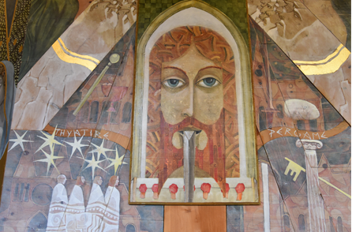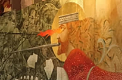

Le livre est écrit dans le langage de l'Ancien Testament = sorte de vocabulaire de base ! 

* Parmi tous les éléments de la description, seuls 2 sont expliqués : 
  
  > Quant au mystère des sept étoiles que tu as vues dans ma main droite, et aux sept porte-lampes d’or, les sept **étoiles** sont les anges des sept Eglises, et les sept **porte-lampes** sont les sept Eglises.
  
  * annonce des destinataires des 7 lettres
  
  * le Christ se tient "au milieu" des 7 églises
  
  * les 7 anges... qui figurent les 7 églises, sont figurés par les étoiles qui sont dans la main droite du Christ ! 

par ce jeu des symboles, on peut comprendre que les églises sont à la fois dans la monde et dans la main du Christ ! 

#### contenu des 7 lettres

* chacune des 7 lettres fait référence à la situation particulière d'une des 7 églises

  * un même schéma se répète pour chaque lettre
  
* une unité de "message" se laisse repérer, malgré la diversité des situations
  
  > Ap 2,3-4 Tu as de la **persévérance**, tu as souffert à cause de mon nom et tu ne t’es pas lassé. Mais j’ai ceci contre toi : tu as abandonné ton amour premier.
  
  * la persévérance est approuvée,
  
  * mais la "tiédeur" est réprouvée
  
  > Ap 3,15-16 Je connais tes œuvres ; je sais bien que tu n’es ni froid ni bouillant. Si seulement tu étais froid ou bouillant !
  > Ainsi, parce que tu es tiède et que tu n’es ni bouillant ni froid, je vais te vomir de ma bouche.

BROWN résume ainsi (p.842)

"Le message global des sept lettres, qui correspond au thème du reste du livre, est de **tenir bon** et de ne rien concéder à ce que l'auteur désigne comme le mal. Les **promesses** optimistes de **victoire** présentes dans chaque lettre visent à encourager, objectif caractéristique de l'apocalyptique"

> Ap 3,20-21 Je me tiens à la porte et je frappe. Si quelqu'un m'entend et ouvre la porte, j’entrerai chez lui, je dînerai avec lui et lui avec moi.
> Le vainqueur, je lui donnerai de s’asseoir avec moi sur mon trône, comme moi-même j’ai été vainqueur et je me suis assis avec mon Père sur son trône.

On peut parler de conversion, mais en ce sens qu'il faut éviter de se laisser gagner par les dangers extérieurs ou intérieurs à la communauté => retrouver la vigueur de son premier amour !

## Les septénaires

> Ap 4,1 Après cela, je vis **une porte** ouverte dans le ciel. Telle une trompette, la première voix que j’avais entendue parler avec moi dit : **Monte ici**, et je te ferai **voir** ce qui doit arriver après.

En regardant "**en haut**", au-delà du ciel, Jean va **voir** ce qui doit arriver **après**.

Il **entend** également les paroles et les cantiques qui interprètent, ou annoncent, "ce qui doit arriver".

* la "chronologie" des différentes visions est floue
  
  * des verbes au passé se mêlent avec présent et futur
  
  * certains "épisodes" sont évoqués à plusieurs reprises
  
  > **Ap 14,8** : Elle est tombée, elle est tombée, Babylone la Grande
  > 
  > **Ap 17,5** [vision de la grande prostituée] : Sur son front était écrit un nom, un mystère : Babylone la Grande
  > 
  > **Ap 18, 2** :  Elle est tombée, elle est tombée, Babylone la Grande !

* chaque septénaire est introduit par une grande vision
  
  * et il est "interrompu" entre la 6ème et la 7ème étape

### 1ère série de visions : les 7 sceaux et les 7 trompettes

##### vision inaugurale

> Il y avait **un trône dans le ciel**, et sur ce trône quelqu'un était assis.
> ... 
> Autour du trône, vingt-quatre trônes ; sur ces trônes, **vingt-quatre anciens** assis, habillés de vêtements blancs ; sur leurs têtes, des **couronnes** d’or.

* remarquer la symbolique royale
  
  * un trône plutôt qu'un autel !
  
  * les 24 anciens portent des couronnes

> les vingt-quatre anciens tombent aux pieds de celui qui est assis sur le trône, se prosternent devant celui qui vit à tout jamais et **jettent leurs couronnes** devant le trône, en disant :
> **Tu es digne**, notre Seigneur, notre Dieu, de recevoir la gloire, l’honneur et la puissance, car **c’est toi qui as tout créé**, c’est par ta volonté que tout était et que tout a été créé.

=> première vision du Dieu créateur, dont la majesté est exaltée : sa "royauté" surpasse toute royauté (terrestre et céleste)

> Alors je vis dans la main droite de celui qui était assis sur le trône **un livre** écrit au dedans et au dos, **scellé de sept sceaux**.
> 
> ...
> 
> un **agneau debout**, qui semblait **immolé**... vint recevoir le livre de la main droite de celui qui était assis sur le trône... 
> 
> **Tu es digne** de recevoir le livre et d’en ouvrir les sceaux, car tu as été immolé et tu as acheté pour Dieu, par ton sang, des gens de toute tribu, de toute langue, de tout peuple et de toute nation

=> vision du Christ, agneau immolé mais debout, rédempteur : il est le seul capable de recevoir le livre et d'en ouvrir les sceaux

=> l'Agneau est acclamé dans les mêmes termes que le créateur : "tu es digne..."

La divinité de l'Agneau rédempteur est manifestée dans cette vision d'ouverture

##### les 4 premiers sceaux

> **Ap 6**,1 Je regardai quand l’agneau ouvrit **un** des sept **sceaux**, et j’entendis l’un des quatre êtres vivants dire d’une voix de tonnerre : **Viens** !
> 2 Alors je vis **un cheval blanc**. Celui qui le montait tenait un arc ; une couronne lui fut donnée, et il partit en **vainqueur** et pour vaincre.
> 3 Quand il ouvrit le **deuxième sceau**, j’entendis le deuxième être vivant dire : **Viens** !
> 4 Et un autre **cheval, rouge feu**, sortit. A celui qui le montait il fut donné d’ôter la paix de la terre, pour que les gens s’entre-égorgent ; et une **grande épée** lui fut donnée.
> 5 Quand il ouvrit le **troisième sceau**, j’entendis le troisième être vivant dire : **Viens** ! Alors je vis un **cheval noir**. Celui qui le montait tenait une **balance** à la main.
> 6 Et j’entendis comme une voix au milieu des quatre êtres vivants ; elle disait : Une mesure de blé pour un denier, et trois mesures d’orge pour un denier ; quant à l’huile et au vin, ne leur fais pas de mal !
> 7 Quand il ouvrit le **quatrième sceau**, j’entendis la voix du quatrième être vivant dire : **Viens** !
> 8 Alors je vis un **cheval verdâtre**. Celui qui le montait avait pour nom la **Mort**, et **le séjour des morts l’accompagnait**. Pouvoir leur fut donné sur le quart de la terre, pour **tuer par l’épée, par la famine, par la peste** et par les bêtes sauvages de la terre.

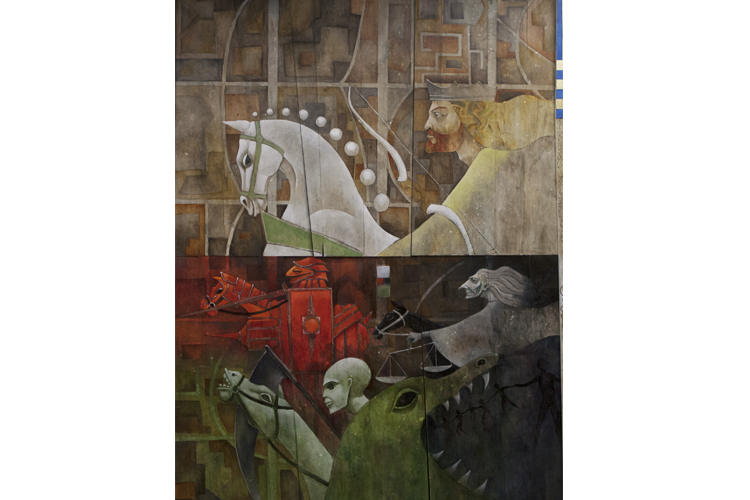

Le trio "l'épée la famine et la peste" apparaît 

* 15 fois dans le livre de Jérémie
  
  > je veux les exterminer par **l’épée**, par la **famine** et par la **peste** [Jr 14,12]
  > 
  > ceux qui dans cette ville auront survécu à la **peste**, à **l’épée** et à la **famine** ; je les livrerai à Nabuchodonosor, roi de Babylone [Jr 21,7]
  > 
  > J’enverrai parmi eux **l’épée**, la **famine** et la **peste**, jusqu'à ce qu’ils aient disparu de la terre que je leur avais donnée, ainsi qu’à leurs pères [Jr 24,10]

* 7 fois dans le livre d'Ezéchiel
  
  > 17 J’enverrai contre vous la **famine** et les **animaux féroces**, qui tueront tes enfants ; la **peste** et le sang passeront au milieu de toi, et je ferai venir **l’épée** sur toi

Le trio "l'épée la famine et la peste" est caractéristique de certains oracles de jugement. 

* rappelons qu'un oracle prophétique de jugement est toujours ordonné à la conversion
  
  > **Jr 27,13.17** Pourquoi devriez-vous mourir, toi et ton peuple, par **l’épée,** par la **famine** et par la **peste**, comme le Seigneur l’a dit à la nation qui ne se soumettra pas au roi de Babylone ? ... soumettez-vous au roi de Babylone, et vous vivrez.
  
  * les catastrophes que sont "l'épée la famine et la peste" doivent faire réfléchir... et permettre les bons choix
  
  * le plus souvent, elles sont exprimées au FUTUR... pour permettre la conversion !

* cette signification "classique" à la manière d'un oracle de jugement trouve une confirmation avec le cinquième sceau
  
  > 9 Quand il ouvrit le **cinquième sceau**, je vis sous l’autel les âmes de ceux qui avaient été immolés à cause de la parole de Dieu et du témoignage qu’ils avaient porté.
  > 10 Ils crièrent : **Jusqu'à quand**, Maître saint et vrai, **tardes-tu à juger**, à venger notre sang en le faisant payer aux habitants de la terre ?

Dans la vision de Ap 6, les cavaliers de l'apocalypse inaugurent les temps de la fin :  ce que le Seigneur a maintes fois promis par la bouche des prophètes, Jean le visualise en vision.

Dans cette vision, deux camps sont clairement démarqués : les justes / les méchants... aucune place pour la demi-mesure !

**l'énigme du cheval blanc**

Le premier cavalier :

* n'est pas associé à un des trois fléaux "l'épée la famine et la peste"

* il peut évoquer la soif de conquête... qui conduit à la guerre, et donc à la famine et aux épidémies... 

* mais sa couleur (blanc) évoque aussi un autre cavalier : Ap 19

> Ap 19, 11-16  
> Alors je vis le ciel ouvert, et un cheval blanc apparut. Celui qui le monte s’appelle Fidèle et Vrai, il juge et fait la guerre avec justice.

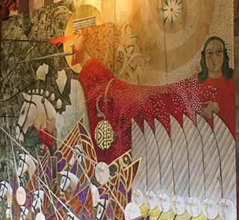

> Ap 6,2 Alors je vis **un cheval blanc**. Celui qui le montait tenait un arc ; une couronne lui fut donnée, et il partit en **vainqueur** et pour **vaincre**.

Le verbe **vaincre**, qui caractérise le premier cavalier (à l'ouverture du premier sceau) fait aussi écho aux promesses contenues dans les 7 lettres qui ouvrent le livre : chacune des 7 lettres se conclut par une promesse "au vainqueur"

> Ap 3,21 Le **vainqueur**, je lui donnerai de s’asseoir avec moi sur mon trône, comme moi-même j’ai été **vainqueur** et je me suis assis avec mon Père sur son trône.

Tous ces éléments permettent de proposer une interprétation positive du premier cavalier : il annonce déjà la victoire ultime.

* les épreuves et les fléaux qui réalisent le "jugement" sont subordonnées à la victoire du **vainqueur**.
  
  * il y a quelque chose de lumineux (blanc) dans le "quarté" gagnant ! 

##### les derniers sceaux

l'ouverture du 6ème sceau déclenche un bouleversement cosmique

> les étoiles du ciel tombèrent sur la terre, comme lorsqu'un figuier secoué par un grand vent laisse tomber ses figues.

même les "grands" sont atteints

> **Les rois de la terre**, les dignitaires, les chefs militaires, les riches, les **puissants**, tous, esclaves et hommes libres, **allèrent se cacher dans les cavernes** et dans les rochers des montagnes

Pour le 7ème sceau, on s'attend à une catastrophe encore plus impressionnante, mais c'est une double vision qui vient interrompre le cycle des 7 sceaux.

> Ap 7,3-4 Ne faites pas de mal à la terre, ni à la mer, ni aux arbres, jusqu'à ce que nous ayons marqué du sceau le front des esclaves de notre Dieu.
> Et j’entendis le nombre de ceux qui avaient été marqués du sceau : cent quarante-quatre mille, de toutes les tribus des Israélites 

* 12000 de chacune des 12 tribus d'Israël
  
  * figure de l'ensemble du peuple de Dieu ?
  
  * figure de l'ensemble du peuple de la première alliance ?

* cette vision est prolongée ("après cela") par une autre

> Ap 7,9-10 Après cela, je vis une grande foule, que **personne ne pouvait compter**, de **toute nation**, de **toutes tribus**, de **tous peuples** et de **toutes langues**. Ils se tenaient devant le trône et devant l’agneau, vêtus de robes blanches, et des branches de palmiers à la main, et ils criaient : *Le salut est à notre Dieu, qui est assis sur le trône, et à l’agneau !*

* cet aperçu du salut vient AVANT le 7ème sceau
  
  * l'ouverture du 7ème sceau, au début du chap. 8, est marqué par un "suspense" dans la liturgie céleste
  
  > Ap 8,1-2  Quand il ouvrit le septième sceau, il y eut **dans le ciel un silence d’environ une demi-heure.**
  >  Je vis les sept anges qui se tiennent devant Dieu ; sept trompettes leur furent données.

* le 7ème sceau... sert essentiellement à enclencher les septénaire des trompettes !

## 2ème série de visions

Elle intègre le septénaire des coupes de la colère de Dieu.

Elle débute par "un grand signe dans le ciel".

AVANT ce grand signe, à la fin du chap. 11 :

> Le sanctuaire de Dieu qui est dans le ciel fut ouvert, et le coffre de son alliance apparut dans son sanctuaire.

L'importance et la solennité du "moment" sont très fortement soulignées.

> Ap 12,1-3  **Un grand signe** apparut dans le ciel : **une femme vêtue du soleil**, qui avait la lune sous ses pieds et une couronne de douze étoiles sur sa tête. Elle était enceinte et elle criait dans les douleurs et les tourments de l’accouchement.
> 3 **Un autre signe** apparut dans le ciel : **un grand dragon** rouge feu qui avait sept têtes et dix cornes, et sur ses têtes sept diadèmes.

* La femme est une figure de l'Église
  
  * Marie est une figure de l'Église
  
  * aspect céleste : soleil, lune, étoires
  
  * aspect terrestre : douleurs de l'enfantement

* grand dragon
  
  * l'Adversaire par excellence
  
  * il sert de "fil rouge" à l'ensemble de la deuxième partie.

Chap 12 : le **dragon** est vaincu par Michel et ses anges

=> précipité "en bas"

* il ne peut plus accéder au ciel

* il lui reste encore un peu de temps sur la terre

Chap 13 : le dragon donne à la **bête de la mer** puissance et grand pouvoir. 

* cette première bête figure la puissance des empires humains, spécialement de l'empire romain. 
  
  * Mais le lecteur sait que le véritable trône est dans le ciel : il est celui du Créateur, et de l'Agneau

* Une **deuxième bête** vient en renfort de la première bête : elle fait des signes qui égarent les habitants de la terre
  
  * Jésus nous a prévenus "prenez garde que personne ne vous égare"

Chap 14 : l'Agneau se tient debout sur la montagne de Sion, avec les 144000 qui portent son nom et celui de son Père => ils chantent un cantique que personne d'autre ne peut apprendre

Suivent 6 anges et 1 fils d'homme qui annoncent les 7 coupes de la colère de Dieu.

> Ap 17,1 Alors l’un des sept anges qui tenaient les sept coupes vint parler avec moi. Il me dit : Viens, je te montrerai le jugement de la grande prostituée qui est assise sur de grandes eaux.

=> jugement de Babylone

## La victoire

> Ap 19,1b-2 Alléluia ! Le salut, la gloire et la puissance sont à notre Dieu, parce que ses jugements sont vrais et justes. Il a jugé la grande prostituée qui ruinait la terre par sa prostitution, et il a vengé le sang de ses esclaves en le lui réclamant.

Puis 

> Ap 19, 11-16  
> Alors je vis le ciel ouvert, et un cheval blanc apparut. Celui qui le monte s’appelle Fidèle et Vrai, il juge et fait la guerre avec justice.

> Ap 19,20  La **bête** fut prise, et avec elle le prophète de mensonge qui avait produit devant elle les signes par lesquels il avait égaré ceux qui avaient reçu la marque de la bête et qui se prosternaient devant son image. Tous deux furent jetés vivants dans l’étang de feu où brûle le soufre.

> Ap 20,1-2  Alors je vis descendre du ciel un ange qui tenait la clef de l’abîme et une grande chaîne à la main.
> Il saisit le **dragon**, le serpent d’autrefois, qui est le diable et le Satan, et il le lia pour mille ans.

> 7-9 Quand les mille ans seront achevés, le Satan sera relâché de sa prison, et il **sortira** pour égarer les nations [...], afin de les rassembler pour la guerre. [...] Ils montèrent sur toute la surface de la terre et ils investirent le camp des saints et la ville bien-aimée. Mais un feu **descendit** du ciel et les dévora.

> 10 Le **diable** qui les égarait fut **jeté dans l’étang de feu et de soufre**, où sont la bête et le prophète de mensonge.

> 13-14 La mer rendit les morts qui étaient en elle, la mort et le séjour des morts rendirent les morts qui étaient en eux, et ils furent jugés, chacun selon ses œuvres.
> La mort et le séjour des morts furent jetés dans l’étang de feu. L’étang de feu, c’est la seconde mort.

### La Jérusalem céleste

> Ap 21,1-5 Alors je vis un ciel nouveau et une terre nouvelle ; car le premier ciel et la première terre avaient disparu, et la mer n’était plus.
> Et je vis descendre du ciel, d’auprès de Dieu, la ville sainte, **la Jérusalem nouvelle**, prête comme une mariée qui s’est parée pour son mari.
> J’entendis du trône une voix forte qui disait : **La demeure de Dieu est avec les humains** ! Il aura sa demeure avec eux, ils seront ses peuples, et lui-même, qui est Dieu avec eux, sera leur Dieu.
> **Il essuiera toute larme de leurs yeux, la mort ne sera plus**, et il n’y aura plus ni deuil, ni cri, ni douleur, car les premières choses ont disparu.
> Celui qui était assis sur le trône dit : De tout je fais du nouveau.
> 
> Et il dit : **Écris**, car **ces paroles sont certaines et vraies**.

Le livre de l'Apocalypse dit vrai... à condition d'entrer dans son langage déroutant :

* symbolique

* hymnique

* non pas comme une prévision,
  
  * mais comme une grande vision
  
  * qui permet de contempler déjà la vérité de la VICTOIRE de l'Agneau
  
  * au milieu d'un monde marqué par le mal, la souffrance, la puissance qui écrase

## Apocalypse et liturgie

Entrer dans le livre de l'Apocalypse, ce n'est pas devenir expert en décryptage de tous les détails du texte.

C'est plutôt contempler cette grande fresque, et reprendre les cantiques qui chantent déjà la victoire de l'Agneau sur toutes les puissances (du mal).

La liturgie nous permet d'entrer déjà dans le mystère de ce qui est célébré.  

*Heureux qui lave son vêtement dans le sang de l'agneau,*

*il franchira les portes de la cité de Dieu,*

*il aura droit au fruit de l'arbre de la vie !*

> Ap 22,2 Au milieu de la grande rue de la ville et sur les deux bords du fleuve, un **arbre de vie** produisant douze récoltes et donnant son fruit chaque mois.
